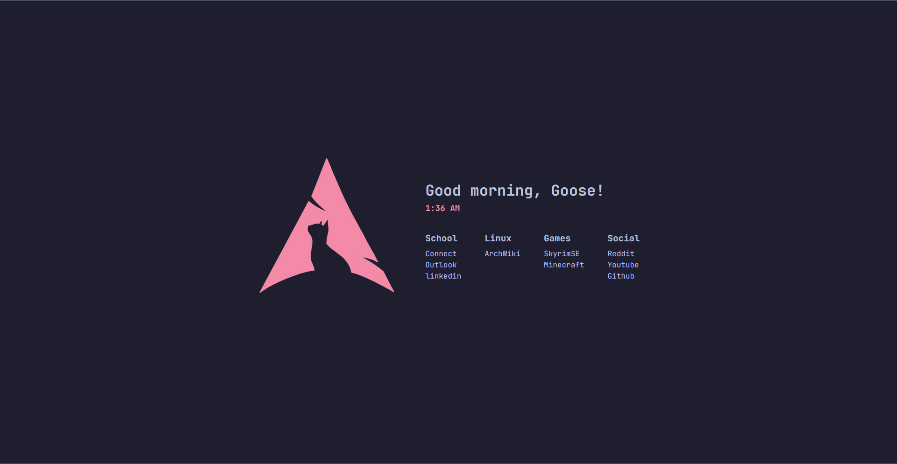

# Startpage

A **minimal startpage** for quick access to my frequently visited links.  
Designed with a clean aesthetic, dynamic greeting, and real-time clock.

  

---

## Features

- **Dynamic Greeting** → Changes based on the time of day (`Good morning, Goose!`).
- **Real-Time Clock** → Displays the current time in `12-hour` format (`1:17 AM`).
- **Custom Links Grid** → Organized by categories (`School`, `Linux`, `Games`, `Social`).
- **Minimalist Aesthetic** → Inspired by terminal UI, with JetBrains Mono font.

---

## Setup

### **1. Clone this repository**

```sh
git clone https://github.com/yourusername/startpage.git
```

Or simply download the files.

### **2. Customize the Links**

Modify the `index.html` file inside:

```html
<div class="category">
    <h3>Games</h3>
    <a href="#">SkyrimSE</a>
    <a href="#">Minecraft</a>
</div>
```

Replace the `#` with actual URLs.

### **3. Set as Browser Homepage**

1. Open your browser settings.
2. Set the **New Tab Page / Homepage** to your `index.html` file location.

---

## Personalization

You can further customize:

- **Background Color & Fonts** → Modify `style.css`
- **Greeting Text** → Edit `script.js`
- **Link Categories & Styling** → Modify the `HTML & CSS`

---

## Future Enhancements

- [ ] Add weather (`Feels like 25°C`)  
- [ ] Make it easily customizable

---

## License

[GPL-3.0](LICENSE)
