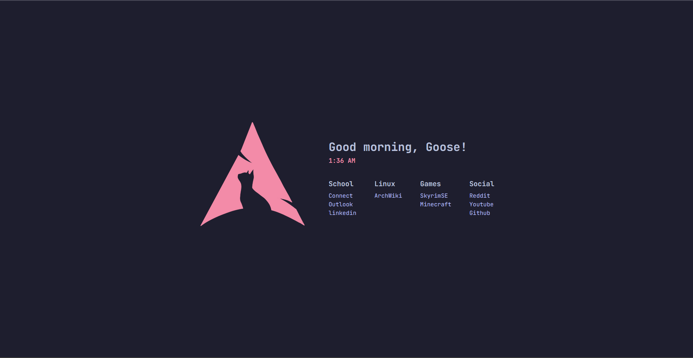

# Startpage

A **minimal startpage** for quick access to my frequently visited links.  
Designed with a clean aesthetic, dynamic greeting, and real-time clock.

  

---

## 3. Usage

```bash
git clone https://github.com/HerzBoi/startpage.git
```

### Linux

I use php and autostart this command whenever my computer boots.

```bash
php -S localhost:8000 -t ~/Documents/startpage
```

>For more infomation on how to use it for [**Linux**](https://wiki.archlinux.org/title/Apache_HTTP_Server#PHP).

### Windows

For **Windows** use [XAMPP](https://www.apachefriends.org/index.html)

### Weather

To get weather to work just create an account for [weatherapi](https://www.weatherapi.com/) and then copy the API key and paste it in a file called `api-key.txt`.

## 4. Personalization

- ### **Greeting Text:**

  Edit `script.js` and change the `u_name` variable

- ### **Links:**

    Modify the `index.html` file inside:

    ```html
    <div class="category">
        <h3>Games</h3>
        <a href="#">"name"</a>
        <a href="#">"name"</a>
    </div>
    ```

    Replace the `#` with actual URLs and `"name"` with the alias for the text.

- ### **Image:**

  edit the `imagey` div in the `HTML` file

---

## Future Enhancements

- [x] Add weather (`Feels like 25°C`)
- [ ] Make it easily customizable

---

## License

[GPL-3.0](LICENSE)
