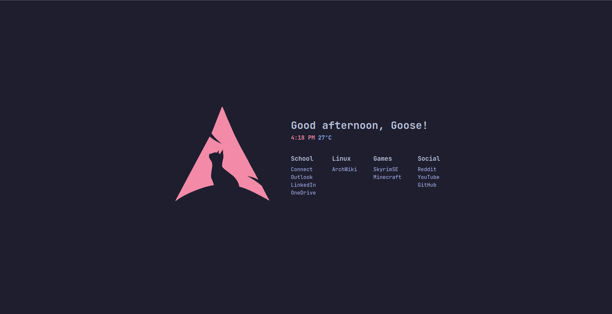

# Startpage

A **minimal startpage** for quick access to my frequently visited links.  
Designed with a clean aesthetic, dynamic greeting, and real-time clock.

  

---

## 🚀 Features
- **Dynamic Greeting** → Changes based on the time of day (`Good morning, Goose!`).
- **Real-Time Clock** → Displays the current time in `12-hour` format (`1:17 AM`).
- **Custom Links Grid** → Organized by categories (`School`, `Linux`, `Games`, `Social`).
- **Minimalist Aesthetic** → Inspired by terminal UI, with JetBrains Mono font.

---

## 🛠️ Setup
### **1️⃣ Clone this repository**
```sh
git clone https://github.com/yourusername/startpage.git
```
Or simply download the files.

### **2️⃣ Customize the Links**
Modify the `index.html` file inside:
```html
<div class="category">
    <h3>Games</h3>
    <a href="#">SkyrimSE</a>
    <a href="#">Minecraft</a>
</div>
```
Replace the `#` with actual URLs.

### **3️⃣ Set as Browser Homepage**
1. Open your browser settings.
2. Set the **New Tab Page / Homepage** to your `index.html` file location.

---

## 🎨 Personalization
You can further customize:
- **Background Color & Fonts** → Modify `style.css`
- **Greeting Text** → Edit `script.js`
- **Link Categories & Styling** → Modify the `HTML & CSS`

---

## 🔮 Future Enhancements
[ ] Add weather (`Feels like 25°C 🌤`)  
[ ] Make it easily customizable

---

## 📜 License
This project is **personal and not intended for public use**, but feel free to fork and modify it.
